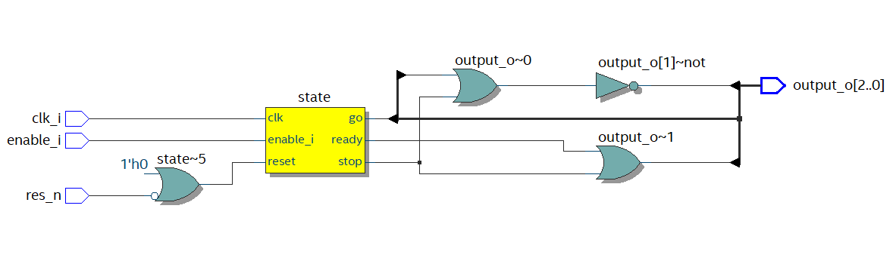
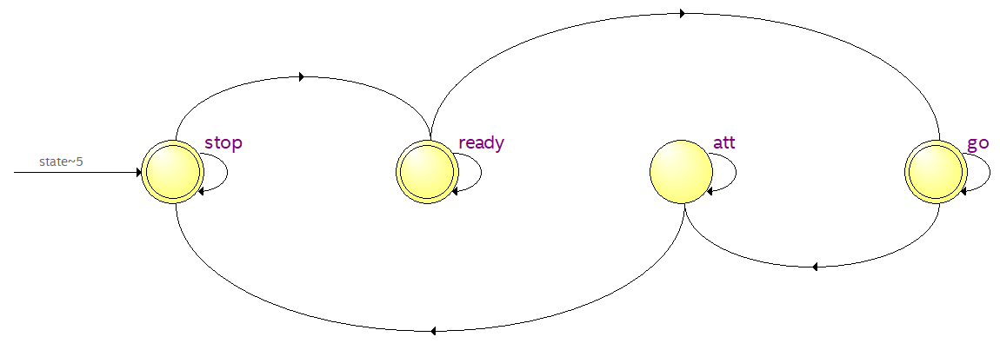

# Ampelsteuerung mit Testbench

### Ampel Code

```vhdl
library ieee;
use ieee.std_logic_1164.all;
use ieee.std_logic_arith.all;

entity ampel is
    port (
      clk_i         : in  std_logic;
      res_n         : in  std_logic;
      enable_i      : in  std_logic;
      output_o      : out std_logic_vector(2 downto 0)
      );
end entity;

architecture rtl of ampel is  

    type state_def is (stop, ready, go, att); 
	attribute enum_decoding: string;
	attribute enum_decoding of state_def: type is "001 011 100 010"; -- Gray code

	signal state, next_state : state_def;
    begin --rtl

    -- implementation of the state register
    state_reg : process (res_n, clk_i) 
    begin
    if (res_n = '0') then
        state <= stop;
    elsif (clk_i'event and clk_i = '1') then
      if enable_i = '1' then
        state <= next_state;
      end if;
    end if;
    end process;
    -- implementation of the state_machine function
    state_func : process(state)
    begin
      case state is
           when stop => 
                  next_state <= ready;
                  output_o <= "001";

            when ready => 
                  next_state <= go;
                  output_o <= "011";

            when go => 
                  next_state <= att;
                  output_o <= "100";

              when att => 
                  next_state <= stop;
                   output_o <= "010";

            when others =>
                  next_state <= stop;
                  output_o <= "001";
        end case;
    end process; -- state function
end rtl; -- architecture

configuration ampel_conf of ampel is 
  for rtl
  end for;
end ampel_conf;
```


### Testbench Code

```vhdl
LIBRARY ieee;
USE ieee.std_logic_1164.ALL;
USE ieee.numeric_std.ALL;

ENTITY ampel_tb IS 
END ampel_tb;

ARCHITECTURE behavior OF ampel_tb IS 
  COMPONENT ampel
  PORT(
    res_n            : in  std_logic;
    clk_i            : in  std_logic;
    enable_i         : in  std_logic;
    output_o         : out std_logic_vector(2 downto 0)
    );
  END COMPONENT;

  SIGNAL res_n          :std_logic := '1';
  SIGNAL clk            :std_logic;
  SIGNAL enable         :std_logic;
  SIGNAL clk_signal     :std_logic;
  SIGNAL output					:std_logic_vector(2 downto 0);
  SIGNAL clk_period     :time := 2 ms;
   
BEGIN
  uut: ampel 
    PORT MAP(
    res_n => res_n,
    clk_i => clk,
    enable_i => enable,
    output_o => output
  );
  
  generate_clock: process
  begin 
		clk_signal <= '1';
    wait for clk_period * 0.5;    
    clk_signal <= '0';
    wait for clk_period * 0.5;
  end process ;
  clk <= clk_signal;

  -- *** Test Bench - User Defined Section ***
  control_sig : PROCESS -- unconstained process
  BEGIN
    wait for 500 us;
    res_n <= '1';
    
    wait for 1 ms;
    enable <= '0';
		res_n <= '0';
   
		wait for 2.5 ms;
    res_n<='1';
   
	 	wait for 2 ms; 
   	enable <= '1';
   	
		wait for 150 ms;
    assert false report "End of simulation" severity FAILURE;
  END PROCESS;
-- *** End Test Bench - User Defined Section ***
END behavior;
```



