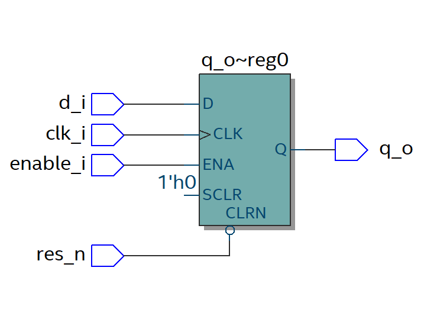

# D-Flip-Flop in VHDL

```vhdl
library ieee;
use ieee.std_logic_1164.all;
use ieee.std_logic_arith.all;

entity dFF_simple is
port (
  res_n          : in  std_logic;
  clk_i          : in  std_logic;
  enable_i       : in  std_logic;
  d_i			: in  std_logic;
  q_o          	 : out std_logic
  );
end entity;

architecture rtl of dFF_simple is
begin  

dFF_p: process(res_n, clk_i)
begin
  if (res_n = '0') then
	 q_o <= '0';
  elsif (clk_i'event and clk_i = '1') then
    if (enable_i = '1') then
			q_o <= d_i;
    end if;
  end if;
end process;
end rtl;

configuration dFF_simple_conf of dFF_simple is 
  for rtl
  end for;
end dFF_simple_conf;
```

